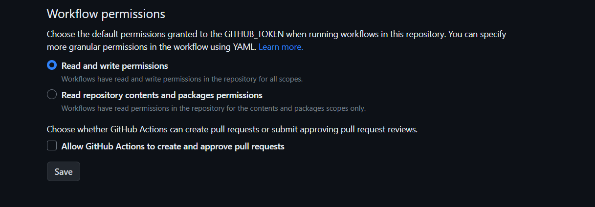

---
title: Github Action 테스트
date: 2025-03-07 00:07:00+0000
categories:
    - 개발자노트
---


깃허브액션을 잘 사용을 하면 좋을것 같안데,
사용법을 잘 몰라서 연습용으로
작성한 글입니다.

자동으로 깃허브 액션이 동작되는지 테스트할겁니다.

https://github.com/ad-m/github-push-action/issues/96

에 보면

리파지트에서
Settings > Actions > General >
에서



처럼

```

Workflow permissions
Choose the default permissions granted to the GITHUB_TOKEN when running workflows in this repository. You can specify more granular permissions in the workflow using YAML. Learn more about managing permissions.

● Read and write permissions
~~~~~~~~~~~~~~~~~~~~~~~~~~~~
  Workflows have read and write permissions in the repository for all scopes.
  
○ Read repository contents and packages permissions
  Workflows have read permissions in the repository for the contents and packages scopes only.

Choose whether GitHub Actions can create pull requests or submit approving pull request reviews.
□ Allow GitHub Actions to create and approve pull requests

```
설정하여야 합니다.


