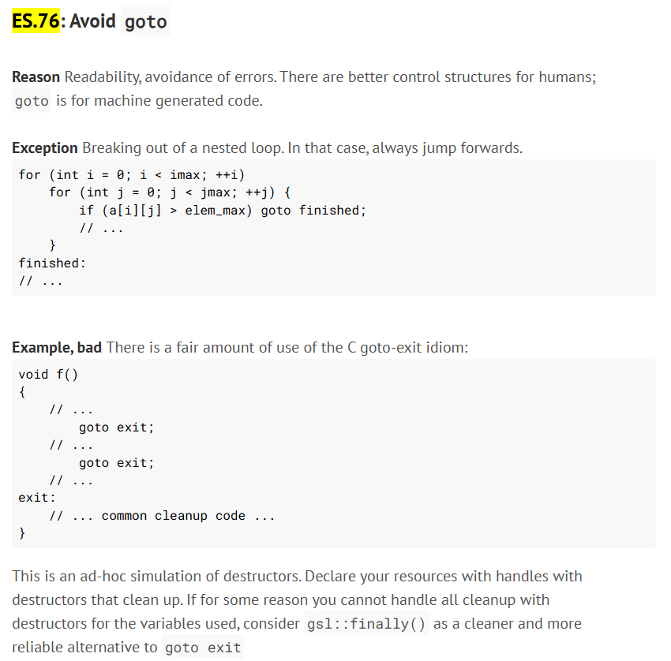

# C++ 문서

## 코딩 가이드 라인

### _t 로 끝나는 타입

- C 스타일 typedef에서 _t 접미사를 많이 썼지만, C++ 표준에서는 권장하지 않음.

- 공식 문서(C++ Core Guidelines)

    > NL.5: Avoid encoding type information in names  

    - **NL.5: 이름에 타입 정보를 인코딩하지 마라.**

        * 이름에 타입 정보(_t, _ptr 등) 넣지 말 것.
        * 의미와 역할이 드러나는 이름을 쓸 것.

### goto 문

- goto는 특별한 경우(**중첩 루프 탈출 등**) 외엔 사용하지 않는 게 좋음.
- 흐름 추적, 유지보수, 디버깅이 어려워짐.
- 대부분 함수, 루프, 조건문, 예외 처리(try-cathe, throw)로 대체 가능.
- C 스타일 예외 처리(goto-exit idiom)가 필요할 때만 사용.
   - C++에서 try-catch을 통한 예외처리를 사용하지 않을 때는, **goto문을 사용해도 됨**.

- 공식 문서(C++ Core Guidelines)

    > ES.76: Avoid goto  

    - **ES.76: goto를 사용하지 마라.** 
        - goto 사용 피할 것.  

        

