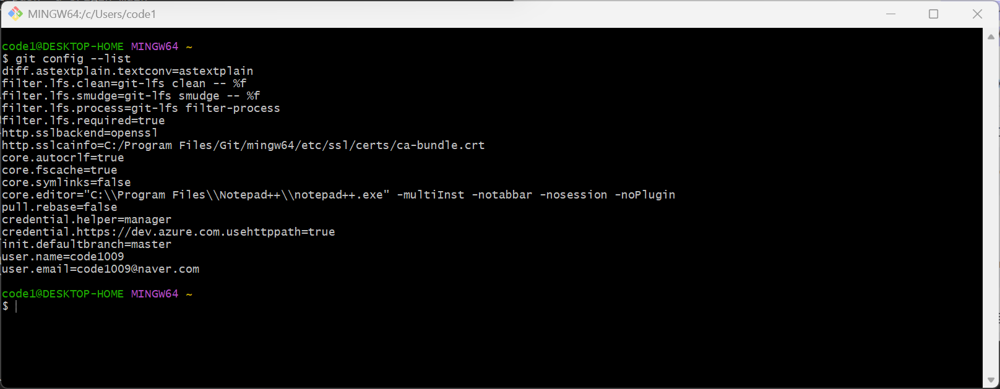

# git 명령어


## 최초 git 설정

* https://git-scm.com/ 설치
* git bash 열기

```
git config --global user.name "{사용자-이름}"
git config --global user.email "{사용자-이메일}"
git config --list
```



## 새 저장소 만들기

```
echo "# test" >> README.md
git init
git add README.md
git commit -m "first commit"
git branch -M master
git remote add origin https://github.com/code1009/{저장소-이름}.git
git push -u origin master
```


## 기존 저장소 푸시

```
git remote add origin https://github.com/code1009/{저장소-이름}.git
git branch -M master
git push -u origin master
```


## 원격 연결 확인

* 명령어
```
git remote -v
```

* 출력결과
```
origin  https://github.com/code1009/{저장소-이름}.git (fetch)
origin  https://github.com/code1009/{저장소-이름}.git (push)
```


## 복제(clone)

```
git clone {저장소-주소} {로컬-폴더}
```


## 로컬에서 브랜치 생성 및 전환

```
git checkout -b {브랜치-이름}
```
> `-b` 생성 옵션


## 로컬에서 브랜치 생성 및 전환 후 푸쉬

```
git push --set-upstream origin {브랜치-이름}
```

> 최초 푸시 시 필요함


## 원격 동기화

```
git fetch origin
```


## 로컬에서 브랜치 전환

```
git checkout {브랜치-이름}
```


## 충돌(conflict) 이후 해결 예시

* develop 브랜치 최신 내용 feature 브랜치에 병합

```
git checkout develop
git pull origin develop
git checkout feature
git merge develop
```

* 충돌 해결 후 커밋 및 푸시

```
git add .
git commit -m "resolve conflicts"
git push
```


## 서로 다른 저장소 이력 병합

```
git pull origin {브랜치-이름} --allow-unrelated-histories
```


## 저장소 초기화

```
{.git 폴더 삭제(`rmdir /s /q .git`)}
git init
git add --all
git commit -m "init"
git remote add origin https://github.com/code1009/{저장소-이름}.git
git push -f origin master
```


## 커밋 이력 확인

```
git log
```


## 저장소 상태 확인

```
git status
```


## 덮어쓰기

```
git reset --hard origin
git reset --soft origin
git reset --soft HEAD~{커밋수}
git reset --hard origin/{브랜치-이름}
```


## 커밋 합치기

```
git rebase -i HEAD~{커밋수}
```
> 가급적 금지
>	> 협업 중인 브랜치에서 rebase는 충돌 및 이력 꼬임 위험


