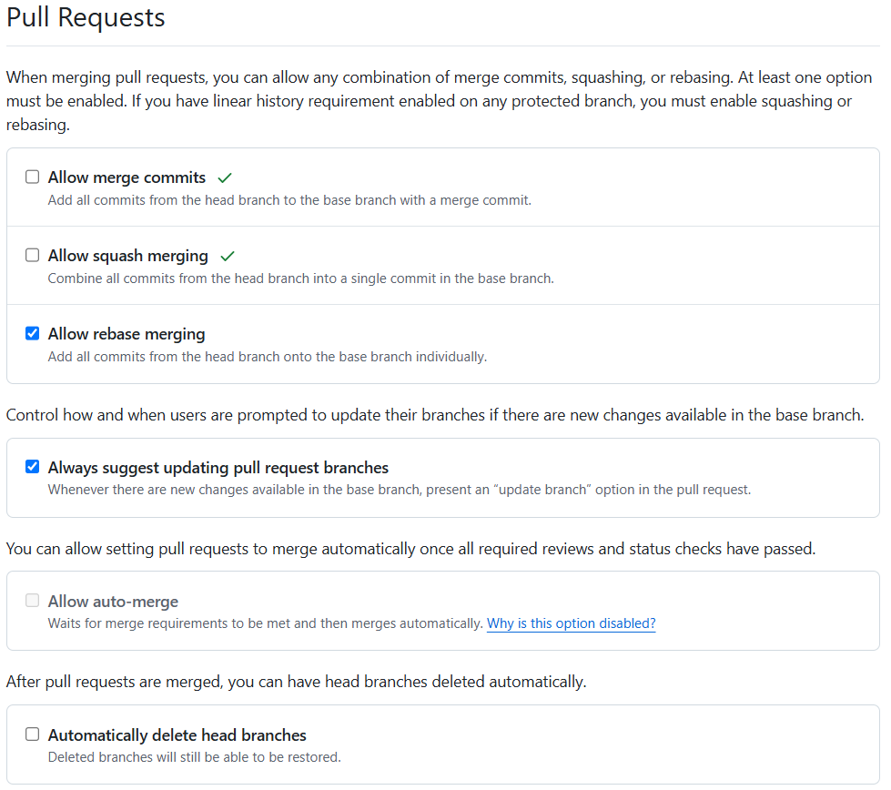
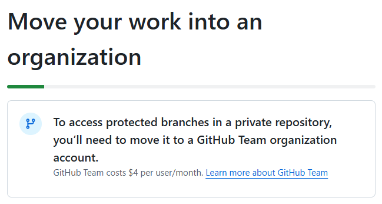
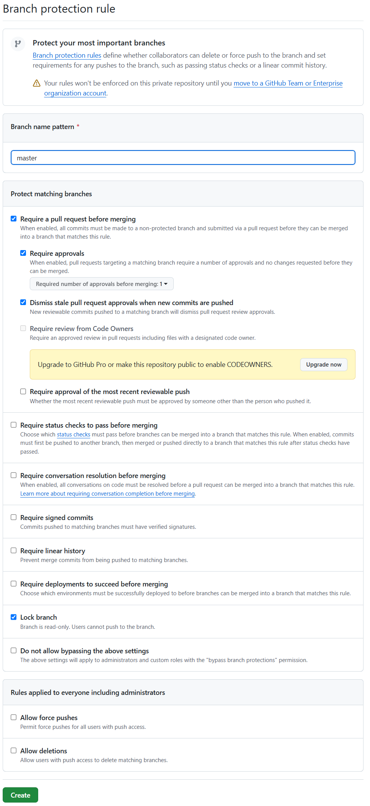

# GitHub 

## 설정

### 풀리퀘스트(PR:Pull Requests)

* `Settings/General`
    - `Pull Requests`

### master 브랜치 보호

* `Settings/Branches`

    - `Add classic branch protection rule`

* `Branch protection rule`

    [!CAUTION]  
    > 이 규칙은 **비공개 저장소**에서는 GitHub Team 또는 Enterprise 조직 계정으로 이동하기 전까지 적용되지 않습니다.  
    > **비공개 저장소**에서 보호된 브랜치를 사용하려면, 저장소를 GitHub Team 조직 계정으로 이동해야 합니다.  
    > GitHub Team은 **사용자당 월 $4**의 비용이 발생합니다.  

Move your work into an organization