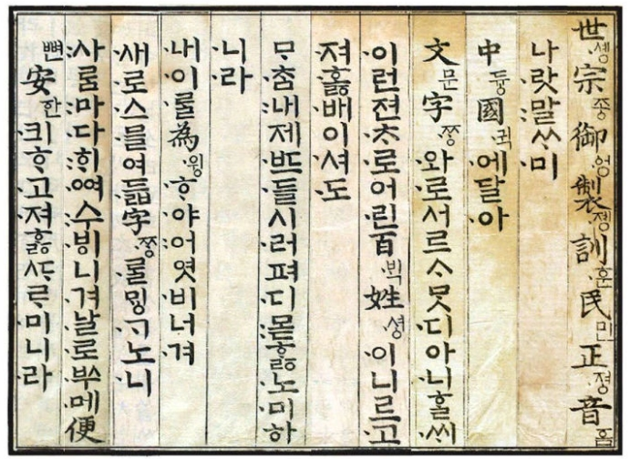

# 마크다운 문법

## 1. 제목

### 1.1. 제목
* 예제
```
제목 H1
=============
```

* 미리보기
  > 제목 H1
  > =============


###  1.2. 부제목
* 예제
```
제목 H2
-------------
```

* 미리보기
  > 제목 H2
  > -------------


### 1.3. 제목: 1~6까지만 지원
* 예제
```
# 제목H1
## 제목H2
### 제목H3
#### 제목H4
##### 제목H5
###### 제목H6
```

* 미리보기
  > # 제목H1
  > ## 제목H2
  > ### 제목H3
  > #### 제목H4
  > ##### 제목H5
  > ###### 제목H6


## 2. 인용

### 2.1. 인용
* 예제
```
> 인용1
>	> 인용2
>	>	> 인용3
```

* 미리보기
> 인용1
>	> 인용2
>	>	> 인용3


### 2.1. 인용(다른 마크다운 요소 포함)
* 예제
```
> ### 제목H3
> * List
>	```
>	code
>	```
```

* 미리보기
> ### 제목H3
> * List
>	```
>	code
>	```


##  3. 목록

### 3.1. 순서있는 목록(번호)
* 예제
```
1. 첫번째
2. 두번째
3. 세번째
```

* 미리보기
> 1. 첫번째
> 2. 두번째
> 3. 세번째


### 3.2. 순서없는 목록(제목 기호: `*`, `+`, `-` 지원)
* 예제
```
* 빨강
  * 녹색
    * 파랑

+ 빨강
  + 녹색
    + 파랑

- 빨강
  - 녹색
    - 파랑
```

* 미리보기
> * 빨강
>   * 녹색
>     * 파랑
> 
> + 빨강
>   + 녹색
>     + 파랑
> 
> - 빨강
>   - 녹색
>     - 파랑


## 4. 코드
* 예제
<pre>
<code>
```c++
int main() 
{
    printf("Hello, Honeymon");
    return 0;
}
```
</code>
</pre>

* 미리보기
> ```c++
> int main() 
> {
>     printf("Hello, Honeymon");
>     return 0;
> }
> ```


## 5. 수평선 ```<hr/>```
* 예제
```
* * *

***

*****

- - -

---------------------------------------
```

* 미리보기
> * * *
> 
> ***
> 
> *****
> 
> - - -
> 
> ---------------------------------------


## 6. 링크
* 예제
```
[https://github.com/code1009](https://github.com/code1009)  
```

* 미리보기
> [https://github.com/code1009](https://github.com/code1009)  


## 7. 강조
* 예제
```
*single asterisks*
_single underscores_
**double asterisks**
__double underscores__
~~cancelline~~
```

* 미리보기
> *single asterisks*  
> _single underscores_  
> **double asterisks**  
> __double underscores__  
> ~~cancelline~~  


## 8. 이미지
* 예제
```


```

* 미리보기
> 
> 


### 사이즈 조절
```html 태그 사용```

* 예제
```
</img><br/>
</img>
```


## 9. 줄바꿈

2칸 이상 띄어쓰기를 하면 줄이 바꿈이 됨.

* 예제
```
가나다라마바사
아자차카타파하

가나다라마바사__
아자차카타파하
```

* 미리보기
> 가나다라마바사
> 아자차카타파하
>
> 가나다라마바사```__```  
> 아자차카타파하
