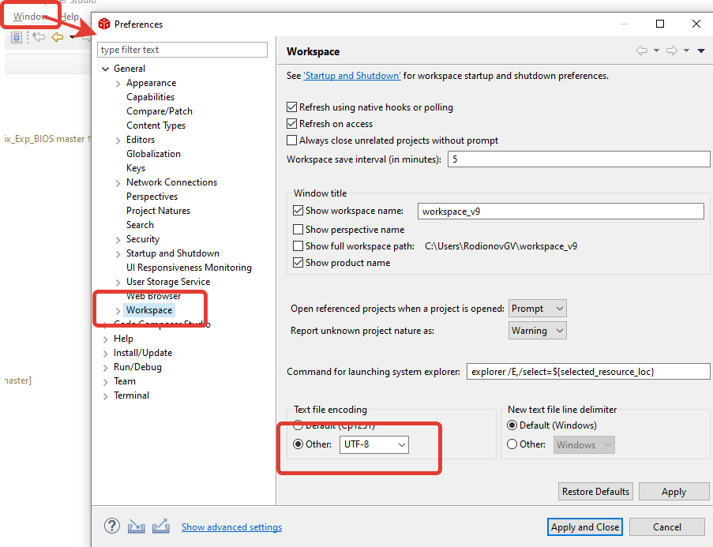

# Visual Studio 기본설정

## 코딩폰트
- D2Coding ligature 사용  
  [https://github.com/naver/d2codingfont](https://github.com/naver/d2codingfont)

## Visual Studio 자동으로 소스코드를 자동으로 utf8로 저장

### CCS(Eclipse)

